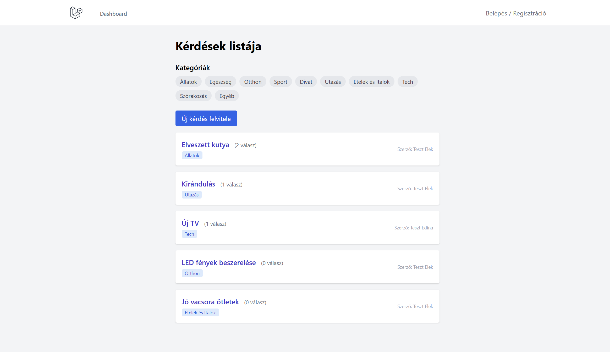
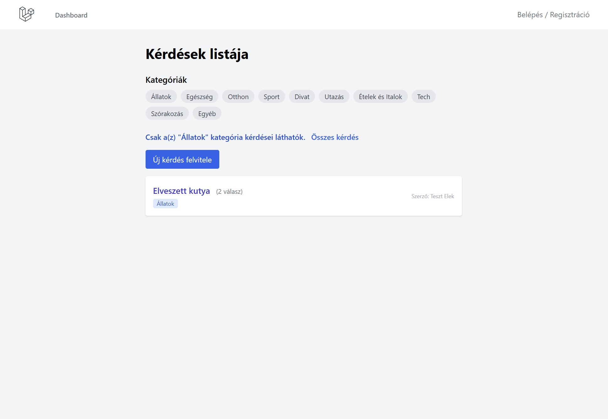
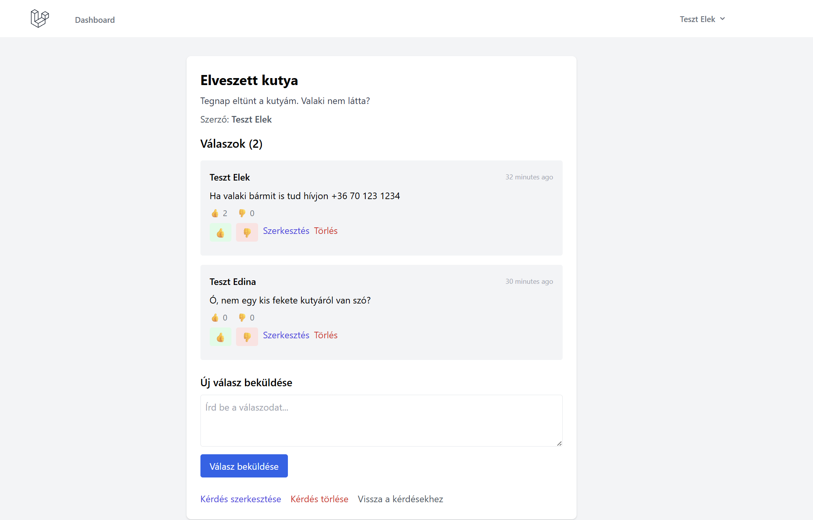
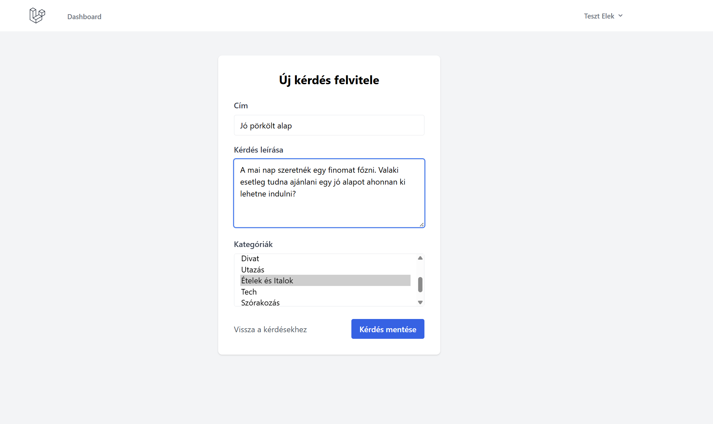
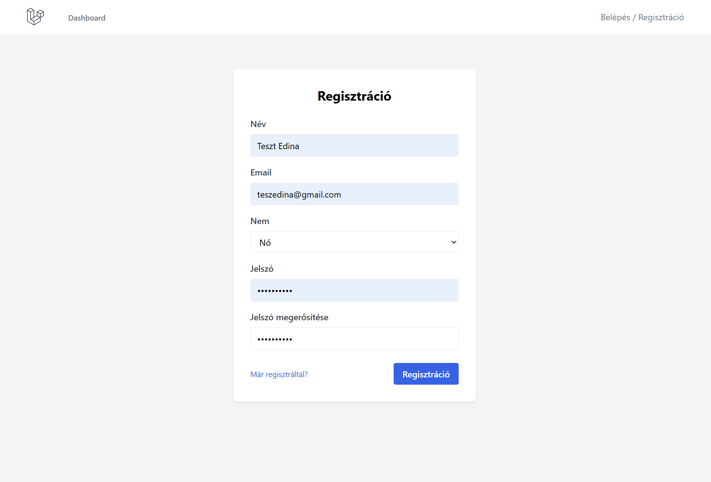
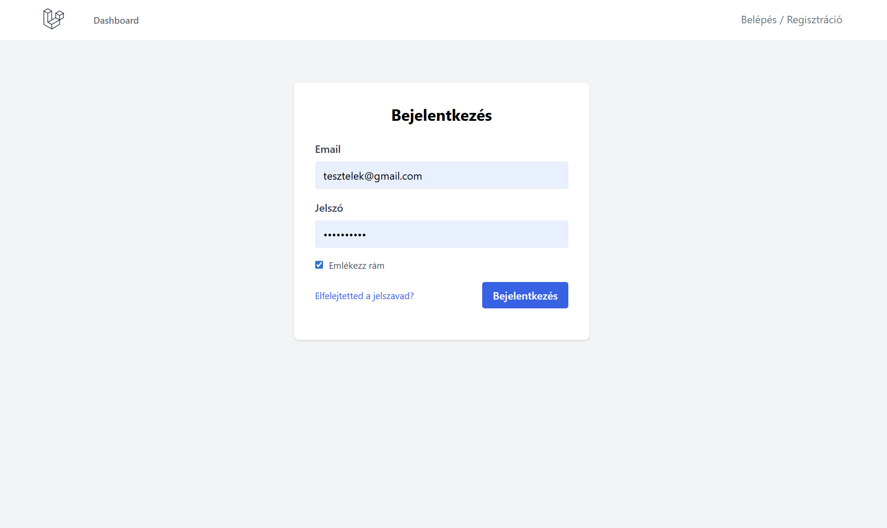
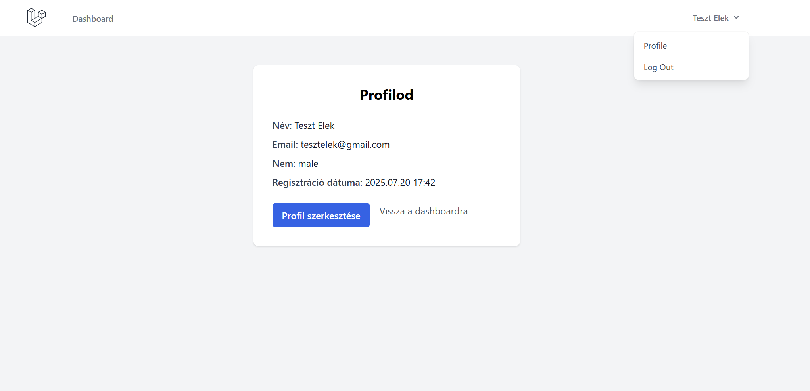
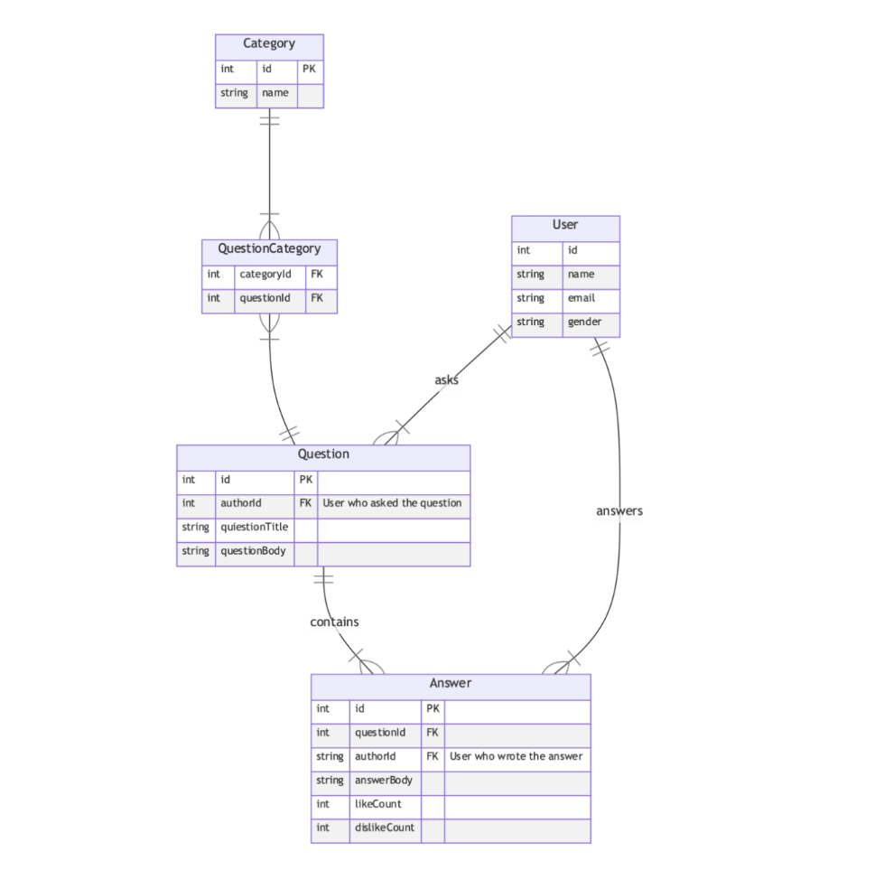

# GYIK (FAQ) Laravel Felvételi Projekt

Ez egy gyakran ismételt kérdések (GYIK / FAQ) webalkalmazás, amelyet a felvételi feladat kiírása alapján készítettem el.  
Az oldal hasonlóan működik, mint a gyakorikerdesek.hu vagy a stackoverflow.com.

## Fő funkciók

- **Kérdések felvitele**: Bejelentkezett felhasználók új kérdést tehetnek fel, több kategóriát is választhatnak.
- **Kérdések listázása**: Főoldalon a legnépszerűbb kérdések láthatók, válaszok számával.
- **Kategóriák**: 10 előre definiált kategória, szűrési lehetőség.
- **Kérdés aloldal**: Megjelenik a kérdés, szerző, leírás, összes válasz.
- **Válaszok felvitele**: Bejelentkezve lehet válaszolni egy kérdésre.
- **Válaszok értékelése**: Minden válaszra lehet pozitívan (like) vagy negatívan (dislike) reagálni.
- **Kérdés/válasz szerkesztése és törlése**: Csak a szerző módosíthatja vagy törölheti.
- **Felhasználókezelés**: Regisztráció, bejelentkezés, profil megtekintése.
- **Dashboard**: Saját kérdések listája.
- **Adatbázis relációk**: Minden kapcsolat az ERD diagram szerint.

## Képernyőképek

### Főoldal (Kérdések listája)


### Kategória szűrés


### Kérdés aloldal


### Új kérdés felvitele


### Regisztráció


### Bejelentkezés


### Profil oldal


## Telepítés és futtatás

1. **Függőségek telepítése**:
    ```sh
    composer install
    npm install
    ```

2. **Környezet beállítása**:
    - Hozz létre egy .env fájlt a tartalma legy az .env.example
    ```sh
    copy .env.example .env
    php artisan key:generate
    ```
3. **Migrációk és seederek futtatása**:
    ```sh
    php artisan migrate
    php artisan db:seed --class=CategorySeeder
    ```
    - Ez létrehozza a táblákat és feltölti az előre beállított 10 kategóriát.
4. **Fejlesztői szerver indítása**:
   Ezt a két parancsot 2 külön terminálban kell futtatnod:
   - **1. terminál:**
    ```sh
    php artisan serve
    ```
   - **2. terminál:**
    ```sh
    npm run dev
    ```

5. **Tailwind CSS fordítása**:  
   A stílusok megjelenítéséhez ezt a parancsot futtasd egy **3. terminálban:**
    ```sh
    npx tailwindcss -i ./resources/css/app.css -o ./public/build/app.css --watch
    ```

6. **Alkalmazás használata**: 
- Nyisd meg a böngészőben: [http://127.0.0.1:8000/questions](http://127.0.0.1:8000/questions)
- Az oldalon regisztrált felhasználók tudnak feltenni kérdéseket, válaszolni kérdésekre valami likeolni és dislikolni a kérdésekre jött válaszokat.

## Adatbázis szerkezet (ERD)



## Funkciók részletesen

- **Kérdés felvitele**: Csak bejelentkezve, több kategóriát választhatsz.
- **Kérdés szerkesztése/törlése**: Csak a szerző.
- **Válasz felvitele**: Csak bejelentkezve.
- **Válasz szerkesztése/törlése**: Csak a szerző.
- **Válasz értékelése**: Like/dislike gombok, összesítés.
- **Kategória szűrés**: Kategóriára kattintva csak az adott kategória kérdései látszanak.
- **Profil oldal**: Saját adatok megtekintése.
- **Dashboard**: Saját kérdések listája.

## Tesztelés

- Minden fő funkció manuálisan tesztelve.
- A projekt tartalmaz egy feature tesztet, amely ellenőrzi, hogy egy bejelentkezett felhasználó sikeresen tud új kérdést létrehozni, és a kérdés az adatbázisba kerül

## Főoldal elérése

A főoldal a kérdések listájával itt érhető el:  
[http://127.0.0.1:8000/questions](http://127.0.0.1:8000/questions)

Itt láthatók a legnépszerűbb kérdések, kategóriák, szűrési lehetőség, valamint innen indítható új kérdés felvitele is.


## Készítő

- Név: Szekeres Nimród
- Email: szekeres.n04@gmail.com
- Felvételi projekt a WebOrbit nevű cég számára.

---

**Köszönöm, hogy megnézed a projektet!**
